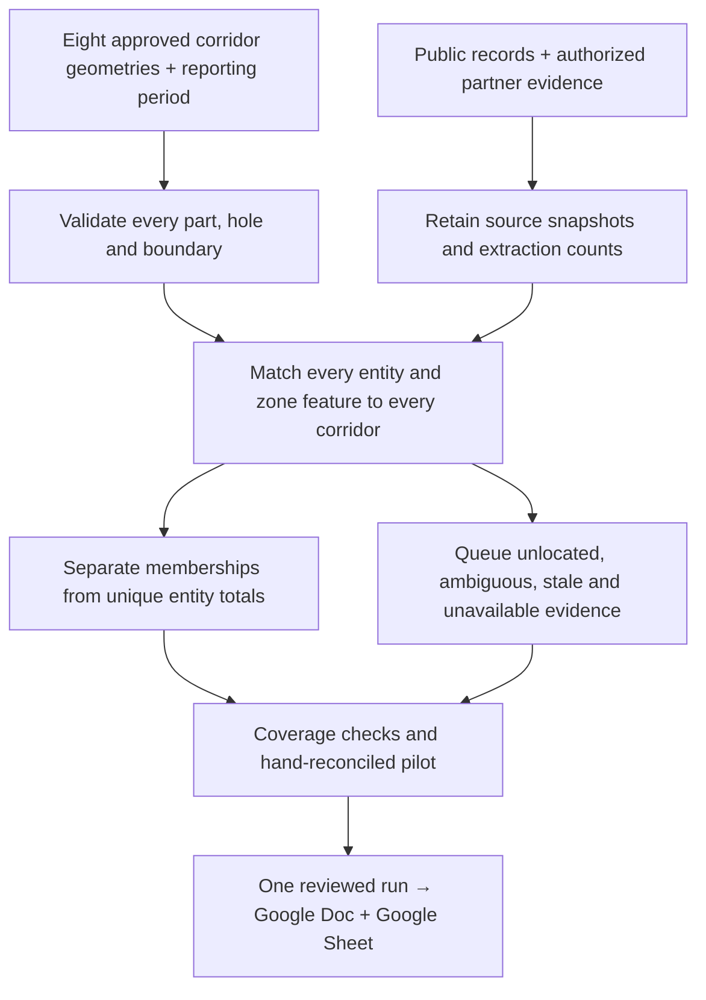

# Corridor Intelligence: research and polygon coverage plan

Prepared September 24, 2026 for BJT-154. This is a research/implementation plan, not a completed polygon data run.

[Research workbook](https://docs.google.com/spreadsheets/d/1dGr7_aJ_ezYt5rLM21t_jXTvGG1UN4PN570vIgii0Tc/edit#gid=24092401) · [Ellen's brief](https://docs.google.com/document/d/1-mhQetxqLvUJK6sJwRUK_6938ebpMKC9Pitv_7drUQk/edit) · [BJT-154](https://linear.app/bjtheartist/issue/BJT-154/restore-corridor-intelligence-and-automate-source-backed-corridor)

## Main finding

The existing code does not have one corridor-wide spatial contract. It mixes ZIP aggregates, point-in-zone discovery and drawn-area queries. The eight requested corridors are text definitions without approved GIS polygons. A correct point lookup therefore cannot establish that every polygon intersecting a street corridor was checked.

This audit inspected local revision `851eb9e397b998f4dc599129369a216d728fdb2b`, the linked scope and the local zone files. It did not query production database counts or reproduce the specific area where Billy observed a miss. Current loaded coverage and provider freshness remain unverified.

## Three kinds of geography

| Geography | Role | Required operation |
| --- | --- | --- |
| Eight corridor footprints | Define the population being measured | Approve versioned polygons, street sides, frontage and side-street exceptions |
| Source geometries: points, parcel footprints and incentive zones | Supply entities and spatial evidence | Match all applicable features; preserve entity IDs and every corridor membership |
| ZIPs, Census tracts and ZCTAs | Provide broader neighborhood context | Keep original geography and vintage; never relabel totals as exact corridor measurements |

## Proposed flow

## Confirmed integration gaps

1. **No approved street geometry.** `lib/corridor-research.ts` stores draft text scopes. `scripts/compute-corridor-aggregate.ts` computes ZIP metrics. Its permit assignment stops after the first ZIP match and omits unusable coordinates. That is a reuse risk for overlapping corridor memberships, not proof that its original ZIP totals are wrong.
2. **Different geometry contracts.** `app/api/vacant/route.ts:540` accepts Polygon only. `app/api/permit-area/route.ts:190` accepts Polygon and MultiPolygon, with at most ten component polygons plus ring/vertex limits. An eight-corridor union can have more than eight parts. Standardize the contract or chunk parts with deduplication; never discard detached pieces.
3. **Point discovery is not an area inventory.** `lib/zones-check.ts:121` uses a first matching feature for each static layer. Its v2 database layer query at line 291 uses `LIMIT 1`. Existing point-discovery behavior can remain; add an area query that returns all intersecting feature IDs and layer states.
4. **Malformed local TIF geometry is reproducible.** Four unclosed interior rings cause Turf point-in-polygon to throw: T-55 (43rd Street/Cottage Grove), T-64 (Northwest Industrial Corridor), T-180 (Red and Purple Modernization Phase One), and T-117 (47th/Ashland). The direct probe used an arbitrary Chicago point to exercise geometry parsing; it does not locate the user's missed area. The v1 safe fallback can skip these features; v2 retains unknown/malformed status when no clean hit resolves a layer. Re-fetch and validate before changing geometry; preserve original/repaired versions.
5. **Returned rows are not proof of complete coverage.** Vacancy caps responses at 10,000 and labels static fallback partial. Records without usable geometry cannot enter the spatial match. Some ingest adapters are ZIP-scoped while permit ingestion is citywide. Verify the upstream extraction universe, not just query results.
6. **Layer health and measurement definitions differ.** The local registry explicitly marks legacy MMRP geometry stale. Other revision tags are code metadata, not a live source-freshness audit. Current area permits begin in 2015, while the historical brief uses a separate trailing 24-month ZIP snapshot. Freeze consistent period, source vintage and entity grain.

The local structural inventory covers all 16 registered polygon layers. It counts features, polygon parts, holes and short/unclosed rings. It is not a full topology audit, live database inventory, current-provider count, or count of overlaps with the eight corridors. Point-only environmental/project layers are separate data sources and should not be treated as missing polygons.

## Research/data map

The workbook's **Research map** tab contains 14 workstreams with source links, record grain, existing implementation, inclusion rule, output and remaining work:

- **Geometry and public records:** requested corridor definitions; Cook County Parcel Universe; parcel footprint/frontage reconciliation; City zoning; business licenses; building permits; City/CCLBA inventory; vacant-building violations; all 16 zone layers.
- **Broader context:** ACS tract/ZCTA estimates and margins of error; ZIP Business Patterns employment/payroll. Preserve their published geography. These do not directly measure businesses or residents along a street.
- **Field and authorized partner evidence:** storefront-unit observations; business assistance and follow-up cohorts; confirmed capital disbursements. These inputs have not been supplied for this run.
- **Measurement design:** A4CB and Main Street examples inform a modest scorecard. They are not corridor baselines, targets, or confirmed Trust requirements.

Start with operating business locations, storefront occupancy, assistance, disbursements, retention and physical activity. Do not infer storefront vacancy from assessor class 1, openings/closures from licenses, delivered dollars from permit estimates, or causal impact from before/after counts. Current area-permit queries intentionally omit reported cost; adding such a measure is a separate definition decision.

## Spatial and completeness contract

**Extract:** Build a source-specific candidate envelope around the approved union only as an optimization. Never use the viewport or a single corridor center as the research universe. Where provider filters are ZIP-based, derive and document the full intersecting ZIP candidate set, and explicitly account for missing ZIPs/coordinates. Retain unlocated candidate records and their available address/PIN evidence for review.

**Validate:** Preserve WGS84 longitude/latitude GeoJSON at interchange, check SRID, finite coordinates, closed rings, holes and all MultiPolygon parts; perform full validity checks before joins. Use an appropriate projected CRS for distance/area calculations. Record any geometry repair with hashes and review; do not silently buffer or simplify away evidence.

**Join points:** Use a boundary-inclusive predicate against every corridor, with source record ID and stable entity ID. PostGIS [ST_Covers](https://postgis.net/docs/ST_Covers.html) includes boundary points; the choice is a proposed corridor rule, not an existing approved measurement definition.

**Join polygons:** Use [ST_Intersects](https://postgis.net/docs/ST_Intersects.html) to identify every candidate zone/parcel intersection, then distinguish positive-area overlap from boundary-only touch. Parcel intersections generate frontage-review candidates rather than automatically including an entire parcel or every unit it contains. Calculate overlap share only with a stated denominator; never turn geometry overlap into program eligibility.

**Preserve memberships:** Store run ID, corridor ID/version, source ID/record ID, entity ID, join rule, match type and QA status. A corner entity can belong to multiple individual profiles. The all-corridor total counts distinct entities across the union, not the sum of corridor totals. License-period, business-location, storefront-unit, permit, project and disbursement keys remain different.

**Reconcile:** For each source, record requested filter/period, provider count where available, pages, raw rows, unique source rows, located/unlocated rows, normalization exclusions with reasons, matched distinct entities, membership rows and records outside scope. Require `located + unlocated = unique source rows` after documented normalization; do not force membership rows to equal unique entities. A zero requires a successful complete query; partial, stale, failed, unmeasured and verified zero stay distinct.

**Display:** Show an 8-by-required-source coverage matrix. Every corridor/source cell exists even when unavailable. Include boundary version, source vintage, extraction state, missing-coordinate count, known truncation and review state. A matching feature in one layer must not hide failure of another layer.

## Sequenced acceptance criteria

1. **Reproduce the reported miss:** capture exact shape or address, expected feature/source ID, layer, request and loaded revision. Compare the same input across database, fallback and rendered map; establish whether failure occurs in extraction, geometry, join, cap, or rendering. No specific root cause is claimed yet.
2. **Approve all eight scopes:** the **Corridor checks** tab retains every supplied endpoint pair. Treat listed intersection fixtures as candidates to confirm on the map. Resolve Commercial Avenue's commercially zoned 2–3-block extensions explicitly.
3. **Pilot difficult geometry:** proposed pilot is Commercial Avenue for side-street/multipart coverage, plus a Stony Island cross-corridor fixture for duplicate membership. Pilot choice is a recommendation, not an assignment.
4. **Shared batch extraction and joins:** all eight corridors, all parts/holes, all required sources and all registered overlay layers produce results or explicit unavailable states. Source requests can be chunked; results retain every membership and dedupe union totals.
5. **Proof before automation:** fixtures include inside/outside/boundary points, a hole, a detached part, two overlapping corridors, multiple same-layer zones, malformed geometry, unlocated records, paging/cap failure and stale source. Hand-reconcile one pilot and require every missing/excluded record to have a reason.
6. **Coordinated outputs:** read back the Doc and Sheet against the same run manifest and coverage matrix. Only reviewed, sufficiently complete measures enter Ellen's brief. No unattended release or source refresh is enabled by this plan.

## Verification and limits

Fifty-five existing targeted tests passed across `app/api/vacant/route.test.ts`, `app/api/permit-area/route.test.ts`, and `lib/__tests__/zones-check-v2.test.ts`. The local ring scan and direct Turf probes reproduced the four TIF parsing failures. These verify local behavior and source-file structure, not production data completeness.

No application code, polygon data, database, schedule or deployment was changed by this research plan. The P0 feature branch was previously pushed; it remains unmerged and undeployed.
