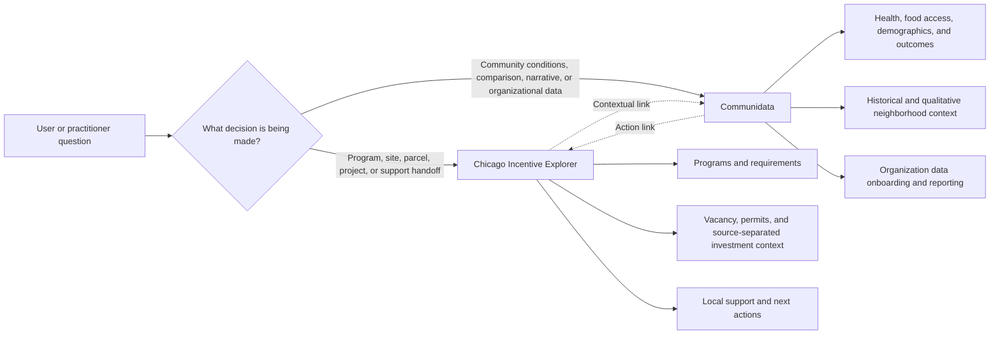

# Product Feedback Decision Matrix

- Status snapshot: August 8, 2026
- Repository baseline: `origin/main` at `a4b8f42`
- Scope: Sana Syed's product review, Ellen Kaulig's funding-landscape additions, practitioner discovery, and the vacancy + permit + investment area-analysis work.

This is an execution document, not a feature wish list. It separates what is verified on the merged baseline from what still needs a production smoke, validation, hardening, implementation, or routing to Communidata.

## Status Key

| Status | Meaning |
|---|---|
| Production-smoked | Present on `origin/main` and directly verified on the live production surface during this review. |
| Merged baseline | Present on the verified `origin/main` baseline. Production deployment and workflow validation are separate checks. |
| Merged baseline + hardening in review | The base capability is on `origin/main`; a follow-up patch exists locally and is not yet merged or deployed. |
| Partially merged | Some enabling product or data work exists on `origin/main`, but the reported user need is not yet fully met. |
| Needs audit | A reported defect or gap must be reproduced and diagnosed before choosing a fix. |
| Not started | No complete implementation was verified in this repository. |
| Routed / parked | Intentionally assigned to another product or held until a prerequisite is met. |

## Product Boundary

| Product home | Core job | Boundary |
|---|---|---|
| Chicago Incentive Explorer | Help a person move from an address or area to programs to review, evidence to verify, a practical next step, and relevant local support. | Do not turn community-condition data into eligibility evidence, promise dollars, certify a project, or imply that a permit, vacancy, or historical award proves a current condition. |
| Communidata | Help organizations understand, compare, explain, and report community conditions and their own data. | Do not overload the Incentive Explorer with every social indicator or treat an uploaded organizational measure as an incentive rule. |
| Shared handoff | Link the products when a site decision needs community context or community analysis needs an action pathway. | Cross-link deliberately; do not duplicate whole products inside one another. |

## Decision Matrix

### Trust And Actionability

| ID | Feedback / decision | Attribution | Product home | Priority | Current status | Evidence | Owner | Acceptance test |
|---|---|---|---|---|---|---|---|---|
| T1 | Explain why a program appears, what is known from public data, what came from user answers, what remains to confirm, and whom to contact. | Sana Syed | Explorer | P0 validation | Merged baseline | `lib/match-transparency.ts`, report renderers, PDF renderer, and `lib/__tests__/match-transparency.test.ts`; merged in PR #119. The public contract deliberately omits score, confidence, benefit range, and deal-value estimates. | Explorer product + engineering | In the five-session sprint, at least four participants can explain why a program appears and name one unresolved requirement without facilitator correction. No participant interprets the result as eligibility or approval. |
| T2 | Correct the `1207 W 63rd Street` result that previously resolved to W Eddy Street. | Sana Syed | Explorer | P0 verify | Production-smoked | `app/api/geocode/route.test.ts` explicitly selects 1207 W 63rd, rejects a street centroid when a house number was requested, and rejects conflicting addresses; merged in PR #119. On August 8, 2026, the production API returned Go Green Community Fresh Market on West 63rd with `matchQuality: exact`. | Explorer engineering | Keep the regression test and include this address in the recurring production smoke set on desktop and mobile. |
| T3 | Investigate Communidata lenses showing identical Income Mobility and Employment Rate values. | Sana Syed | Communidata | P0 | Needs audit; not verifiable in this repository | No Communidata implementation is present in this repository, so this cannot honestly be marked fixed here. | Communidata data + engineering | Reproduce with a named geography, trace each chart to its source field/query, correct the defect or document why the values legitimately match, and add a regression check that compares metric identifiers and outputs. |
| T4 | Make decision-critical charts, legends, labels, and contrast readable. | Sana Syed | Shared by surface | P0 | Partially merged | Explorer has map legends, source labels, funder-type keys, year filters, and chart fallback tables. Sana's usability report has not been closed by a focused accessibility review. | Explorer and Communidata design + engineering | Audit the report, map, area panel, and Communidata comparison views at desktop and mobile widths; all series have visible labels or legends, text meets contrast requirements, focus states are visible, and no content overlaps or requires color alone. |
| T5 | Include direct support contacts and audit missing local organizations. | Sana Syed; practitioner discovery | Explorer | P0 operations | Merged foundation; recurring audit required | `data/curated/support_network_contacts.json` includes verified public intake details and Greater Englewood Chamber Foundation; local-support tests cover its mapped use. | Partner network / SECCC | Every surfaced organization has a current public intake method, source URL, verification date, geography, and support lane. Quarterly review produces an explicit added, changed, confirmed, or retired result for every record. |
| T6 | Preserve unknown and partial source states in drawn-area analysis; disclose permit freshness; export full permit categories; make retries and timeouts reliable. | Engineering audit | Explorer | P0 | Merged baseline + hardening in review | Area permit context is merged in PR #122. The follow-up exists only in local branch `fix/area-analysis-audit-followups` and is not yet merged or deployed. | Explorer engineering + independent reviewer | Vacancy failures never render as a valid zero; partial coverage is disclosed; permit output says when the database was refreshed; CSV includes the complete type breakdown; transient failure has retry; requests abort and time out cleanly; focused tests pass before merge. |

### Workflow And Discoverability

| ID | Feedback / decision | Attribution | Product home | Priority | Current status | Evidence | Owner | Acceptance test |
|---|---|---|---|---|---|---|---|---|
| W1 | Let a user describe a primary goal that does not fit the predefined options. | Sana Syed | Explorer | P1 | Not started | Industry supports custom text, but the primary-goal surfaces use the fixed `SITE_PROJECT_TYPE_OPTIONS`; `other` currently means "Not sure yet" and does not capture the user's own goal. | Explorer product + engineering | Selecting "Something else" reveals optional plain text; the text persists into the report context and handoff without being displayed as a score or converted into a verified eligibility fact. |
| W2 | Make Brownfield and related environmental data easier to find. | Sana Syed | Explorer | P1 validation | Partially merged | Environmental presets already expose Brownfield, LUST, energy-community, and county incentive parcel layers; `components/map/__tests__/map-regression.test.ts` protects reachability. Discoverability has not been validated with users. | Explorer product + design | In three unguided tasks, users can turn on Brownfield/LUST context and explain that it is a screening layer requiring source verification. If two users fail at the same step, revise the preset label, placement, or explanation. |
| W3 | Explain what qualifies as a Local Impact Anchor. | Sana Syed | Explorer | P1 validation | Merged explanation; curation policy needs review | `lib/report-engine.ts` defines anchors as institutions, employers, and destination clusters that can shape neighborhood activity, with source links and a non-authoritative contextual purpose. | Explorer data governance | The UI states the inclusion rationale and source for each anchor. A reviewer can distinguish a curated contextual signal from an official designation, endorsement, or eligibility fact. |
| W4 | Show historical recipients and uses as reference examples. | Sana Syed | Explorer | P1 | Partially merged | Historical recovery and past-award data exist in separate, labeled overlays, and NOF past winners remain contextual. A verified program-page example pattern was not found. | Explorer data governance + engineering | A program page may show examples only when the source identifies both program and recipient/use. Each card names source year and status and says that past participation is not eligibility evidence, current availability, or a promised outcome. |
| W5 | Add useful date-range filtering. | Sana Syed | Shared by surface | P1 validation | Partially merged | Admin community-investment views have bounded year chips and historical recovery overlays remain separate. This does not establish date filtering across all Explorer or Communidata charts. | Product owners + engineering | Each time-based view either has an appropriate range control or explicitly states why the source only supports a fixed period. Shared links preserve the selected range where reproducibility matters. |
| W6 | Expand corridor analysis without restoring an overwhelming legacy report. | Sana Syed; practitioner discovery | Explorer | P1 research | Merged foundation; productization not validated | The legacy `/corridors` route was intentionally sunset. Vacancy workbenches, site activity, permits, drawn-area investment context, and CSV export now provide a stronger foundation for an area workflow. | Explorer product + pilot facilitator | Two partner-defined areas are analyzed around one real decision each. Practitioners can produce a shortlist or next-action memo, explain all source limitations, and identify what still requires field or partner verification. |

### Funding Landscape

| ID | Feedback / decision | Attribution | Product home | Priority | Current status | Evidence | Owner | Acceptance test |
|---|---|---|---|---|---|---|---|---|
| F1 | Expand beyond public incentives into private, philanthropic, and mission-driven capital context. | Sana Syed; Ellen Kaulig | Explorer, gated where required | P1 governance | Partially merged | Foundation grant records, major private developments, and public capital classes are ingested into the private community-investment dataset. The main map keeps this intelligence admin-gated. | Explorer data governance + Ellen review | Every source has a defined funding class, status, geography, freshness, access posture, and release rule before appearing. No public surface implies that historical or announced capital is currently available to the user. |
| F2 | Normalize and audit foundation records before publication. | Ellen Kaulig / funding landscape work | Explorer admin | P0 maintenance | Merged pipeline | Phase 1 through Phase 3 foundation scripts reconcile filings, quarantine unsupported rows, normalize funders, and keep private data outside public assets. | Explorer data engineering + reviewer | Every published filing passes the reconciliation gate; quarantined records stay excluded; duplicate funder coverage fails loudly; a reproducible audit report accompanies each refresh. |
| F3 | Keep unlike money classes separate. | Ellen Kaulig; product safety rule | Explorer | P0 invariant | Merged invariant | `components/investment/StatusCards.tsx`, polygon analysis, and export logic keep awarded grants, announced private capital, TIF authorization, federal commitments, tax-credit allocation, and disbursement evidence under separate nouns. | Explorer product + data governance | No UI, PDF, CSV, API summary, or presentation adds unlike classes into one headline. Missing receipt data renders as unavailable, never `$0`. |
| F4 | Separate current opportunities from historical awards and relief programs. | Ellen Kaulig; discovery conversations | Explorer | P0 invariant | Merged foundation | Closed CARES/ARPA recipient files use separate historical overlays and are excluded from ordinary awarded-capital trends. Report language says historical investment is not current funding. | Explorer data governance | Every historical row carries program status, source date, geography precision, and a clear non-current label. It cannot enter active-program matching or an available-funding total. |

### Communidata Route

| ID | Feedback / decision | Attribution | Product home | Priority | Current status | Evidence | Owner | Acceptance test |
|---|---|---|---|---|---|---|---|---|
| C1 | Add food insecurity, health outcomes, and healthcare-access context. | Sana Syed | Communidata | P2 after trust fixes | Routed; not verified in this repository | This is community-condition context rather than an incentive eligibility rule. | Communidata product + data governance | Each lens has an authoritative source, geography, period, unit, denominator, suppression rule, and plain-language limitation. Explorer links to the relevant Communidata view when a site user asks for community context. |
| C2 | Add qualitative history, articles, research, and community testimony. | Sana Syed | Communidata | P2 research | Routed | No implementation evidence in this repository. Editorial governance and consent are prerequisites. | Communidata product + community partners | Every item has provenance, date, author/community attribution, consent or publication basis, and a clear distinction between sourced fact, interpretation, and testimony. |
| C3 | Explain how organizations upload and integrate their own data. | Sana Syed | Communidata | P1 discovery | Routed; workflow not verified | No Communidata upload implementation is present in this repository. | Communidata product + engineering | A guided flow explains supported formats, required fields, geography, validation, privacy/access, error correction, and the exact output the organization receives. A sample file completes the flow without staff intervention. |
| C4 | Cross-link community context and incentive action at relevant moments. | Product synthesis | Shared | P2 after product-specific trust work | Not started in this repository | The product boundary is defined, but no verified cross-product handoff was found here. | Both product owners | A shared address/geography opens the corresponding product context without silently changing geography, exposing restricted data, or duplicating the entire destination experience. |

## Area Analysis: Safe Interpretation

The vacancy + permit + investment combination is useful because it lets a practitioner compare three different public-record signals in one geography. It is not a score and does not establish causation.

| Observed pattern within the selected geography and source windows | Source-honest reading | Practitioner question | Appropriate next action |
|---|---|---|---|
| More mapped investment records, more permit filings, and fewer tracked vacancies relative to a comparison area | The three located sources overlap here. The records may differ in project, period, status, and coverage. | Which investments and permits refer to the same sites, and what is their sequence? | Verify source records, addresses, dates, and project links before describing a development pattern. |
| More mapped investment records, more tracked vacancies, and fewer permit filings | Current sources show investment records alongside vacancy records but less located permit activity. This is a possible delivery question, not proof that a project stalled. | Are investments recent, unsited, non-construction, outside the permit window, or attached to different parcels? | Review recipients, project scope, dates, permit descriptions, site visits, and partner knowledge. |
| More permit filings, more tracked vacancies, and fewer mapped investment records | Located permit activity is present without much capital captured by the mapped investment sources. It may reflect private financing, maintenance work, missing geography, or source-coverage gaps. | What work was authorized, and what financing or program records are absent from this dataset? | Inspect permit type and work description; verify active projects with owners, lenders, chambers, and public agencies. |
| More tracked vacancies with fewer mapped investment records and permit filings | The current located sources show limited captured activity. This is not proof of stagnation, neglect, or lack of private/community work. | Is the pattern real, or is it caused by source age, unlocated records, informal activity, or the selected boundary? | Validate inventory in the field, inspect source coverage, and ask local partners what the datasets miss. |

### Non-Negotiable Interpretation Rules

- A permit filing is evidence of an authorized filing, not construction start, completion, occupancy, project quality, or financing.
- A tracked vacancy is a lead from a dated source, not proof that a site is currently vacant, available, marketable, or for sale.
- Awarded, authorized, allocated, announced, obligated, expended, and disbursed are different money states and remain separate.
- A missing or failed source is unknown, not zero.
- Historical recipients illustrate prior use; they do not establish present eligibility or availability.
- No combined opportunity, activity, readiness, momentum, or neighborhood score is exposed to users.
- No pattern is labeled "stalled," "successful," "overlooked," or "stagnant" without additional verified project evidence.

## Three User Pathways

| Pathway | Entry question | Product sequence | Definition of done |
|---|---|---|---|
| Business owner / project lead | "What am I trying to do at this address?" | Address -> primary goal -> programs to review -> match explanation -> documents -> local support -> introduction or 1:1 request status | User can name a practical next step, an open requirement, and a relevant support option without believing they are eligible, approved, promised money, or already connected. |
| Corridor / development practitioner | "What decision are we trying to make about this area?" | Draw or select area -> compare source-separated vacancy, permit, and investment signals -> inspect parcels/records -> export -> verify with local partners | Practitioner produces a shortlist or action memo and can explain what every source does and does not prove. |
| Community organization | "What community condition or organizational outcome are we trying to understand?" | Choose geography and measure -> inspect provenance and period -> compare -> optionally add governed organizational data -> export/report -> link to action pathway | Organization can reproduce the analysis, understand privacy and data limitations, and identify whether the next action belongs in Communidata or Explorer. |

## Execution Sequence

### Phase 0: Close Trust Work

1. Independently review and finish `fix/area-analysis-audit-followups`; merge and deploy only after the source-honesty tests pass.
2. Retain `1207 W 63rd` in the recurring production smoke set; the API check passed on August 8, 2026.
3. Reproduce and diagnose the Communidata duplicate-lens report.
4. Run focused accessibility QA on the decision-critical report, map, area panel, and Communidata comparison surfaces.
5. Audit support-network coverage and freshness, including public intake details and missing neighborhood organizations.

### Phase 1: Improve The Action Path

1. Add an optional custom primary-goal field with safe persistence, no displayed score, and no conversion of free text into verified eligibility.
2. Validate environmental-layer and Local Impact Anchor discoverability before redesigning them.
3. Define one governed historical-example card pattern and test it on a single program before expanding.
4. Write the funding-source release contract covering class, status, geography, freshness, access, and exclusions.

### Phase 2: Run Two Bounded Pilots

**Pilot A - Existing five-session project-navigation sprint**

Use `docs/practitioner-validation-sprint.md`. Expand only when at least four of five participants generate a report without rescue, four can state a next step, three take or prepare a useful action, every bad support match is reviewed, and nobody leaves with a material eligibility, dollar, endorsement, or handoff-status misconception.

**Pilot B - Proposed two-area practitioner pilot**

- Select two partner-defined areas and one real decision question for each.
- Include at least one chamber/corridor practitioner, one development or finance practitioner, and one community-development partner.
- Require each participant to inspect raw records, use the CSV, and document what still needs field or partner verification.
- Continue only if each area produces a useful shortlist or action memo and every participant can explain why the three source classes cannot be combined into a causal score.

For either pilot, rethink a step when two or more sessions show the same friction. Record one-off preferences as observations rather than automatic roadmap commitments.

### Phase 3: Expand Only From Evidence

1. Prioritize the workflow improvement supported by repeated pilot evidence.
2. Route health, food-access, qualitative-history, and upload work into a separately scoped Communidata pilot.
3. Expand area or corridor coverage only after the practitioner workflow proves useful and source limitations remain understandable.
4. Keep private and philanthropic intelligence gated until each source passes the release contract.

## Decision Summary

| Lands now | Needs rethinking or validation | Out of current Explorer scope | Actionable next |
|---|---|---|---|
| Match explanations; exact-address geocoding; Greater Englewood contact; permit evidence; source-separated capital; environmental layers; drawn-area analysis foundation | Chart accessibility; environmental/anchor discoverability; custom goals; historical examples; corridor workflow; cross-product links | Health and food-access lenses; qualitative neighborhood history; organizational upload workflow | Finish area-analysis hardening, audit Communidata duplicate metrics, run accessibility/support audits, then execute the two bounded pilots |

## Change Control

Update this matrix only with one of four evidence types:

1. A merged commit and verified production behavior.
2. A reproducible defect with named steps and source/query evidence.
3. A completed user session recorded through the categorical sprint scorecard.
4. An approved data-governance decision with source, geography, status, freshness, access, and exclusion rules.

Do not mark an item complete because a branch exists, a dataset was downloaded, a design was mocked, or a user clicked a link.
